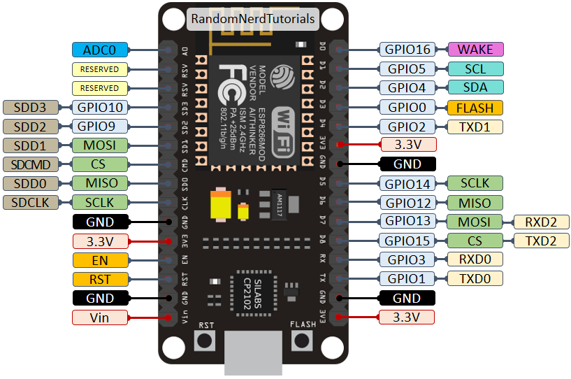
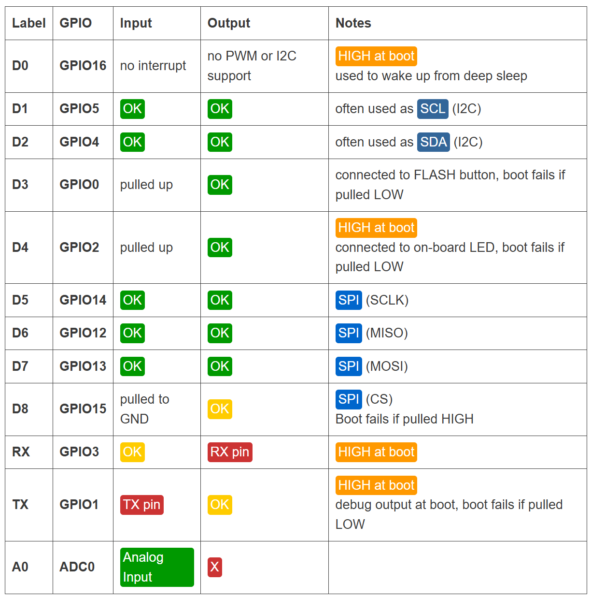
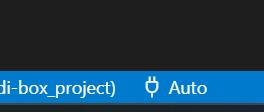

# MIDI-BOX_PROJECT

Este repositório contém o projeto MIDI-BOX para ESP8266/NodeMCU.

## Estrutura do projeto

```text
MIDI-BOX_PROJECT/
├── main.ino   # Arquivo principal (vazio ou apenas setup/loop)
├── src/
│   ├── app/
│   │   ├── inc/         # Headers (.h)
│   │   └── src/         # Código (.cpp)
│   ├── hal/
│   │   ├── inc/         # Headers (.h)
│   │   └── src/         # Código (.cpp)
│   └── port/            # Definições de hardware
```

## Descrição das pastas

- `main.ino`: arquivo principal do Arduino/ESP8266.
- `src/app/inc`: headers do aplicativo.
- `src/app/src`: código-fonte do aplicativo.
- `src/hal/inc`: headers da camada de hardware.
- `src/hal/src`: código-fonte da camada de hardware.
- `src/port`: definições de hardware específicas da placa.

## Diagramas





# Configuração platformio.ini

Ao configurar o ambiente em outra máquina lembresse de redefinir a porta COMx em auto

- Para funcionamendo do OTA utilizando platformIO cno vscode defina a porta COM em 'auto'



https://docs.platformio.org/en/latest/projectconf/index.html